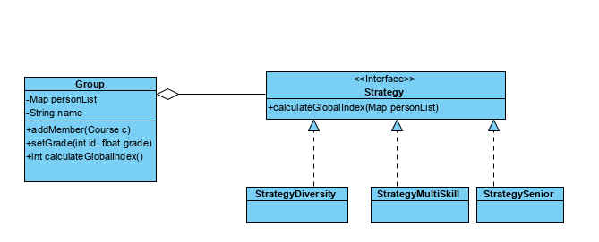

# Aula sobre o pattern Strategy

## Problema
O calculo da média do curso é realizado de forma distinta em função do tipo de estudante (normal, worker, extern)

### Solução Comum:
- Uso de um atributo Type do tipo enumerado
```java
public class Group {

    public enum TYPE {DIVERSITY, SENIOR, MULTYSKILS};

    private TYPE type;
    private String name;
    private Map<Integer, Person> personList;
  /**
     *
     * @param name of the GroupElem
     * @param type of Group
     */
    public Group(String name, Group.TYPE type) {
        this.name = name;
        this.type=type;
        personList = new HashMap<>();
    }

```
O método que implementa o calculo do indice de adequação do grupo de acordo com o perfil pretendido usa uma estrutura switch case para diferenciar o tipo de calculo a fazer.
```java

    public float calculateGlobalIndex()  {
        
        switch (type) {
            case NORMAL:
                //code2              
                break;

            case WORKER:
                //code2
                break;
            case EXTERN:
               //code3
                break;
        }
        return res;
    }

}
```
### Questões ?
- Se for preciso adicionar mais um tipo de perfil de grupo, quais as alterações a fazer?
- Se se pretender implementar um metodo para seleão do lider do grupo que também varie com o perfil do grupo pretendidio, o que acontece?
- Usarmos o polimorfismo seria uma boa solução para resolver este problema?

### Aplicação do Padrão Strategy
- Difinir a interface Strategy
- Implementar as classes que a instanciam (um por cada tipo)
- Alterar a classe Group, substituindo o atributo type por um atributo strategy
- Redefinir o metodo calculateGlobalIndex, delegando o calculo à estratégia atualmente instanciada.



## Exercícios
 - Adicione um novo perfil  : SPECIALIZED, em o indice é calculado da seguinte formula:  
      ````X/(Y-X) 
         X numero de pessoas com mais de 5 anos de experiencia e especializadas no maximo em 3 linguagens
         Y numero total de pessoas````
    
 - Adicione um novo método, para seleção do chefe do grupo que também difere consoante o perfil pretendidio 
    - SENIOR - o membro com mais anos 
    - DIVERSITY - Random
    - MULTISKILLS - o membro com mais linguagens de programação, em caso de empate o mais novo
    - SPECIALIZED - dos membr com masi de 5 anos de eexperiencia, o que domine menos linguagens de programação.
    Implemente o código necessário para disponibilizar o método
    ```java   Person selectLeader() ``` que devolve true se o estudante estiver aprovado.  
    Nota: Deverá usar o padrão Strategy


